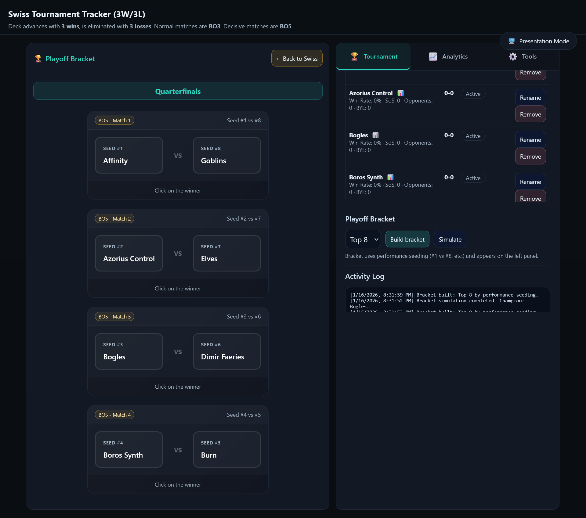
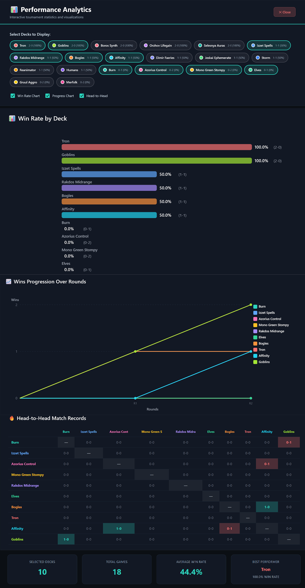
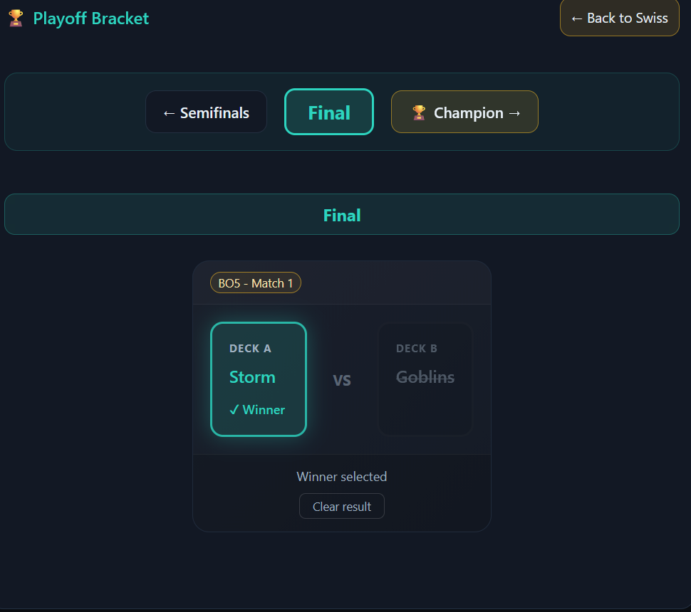
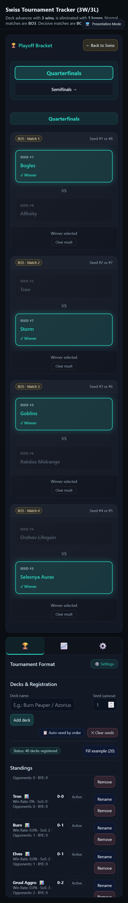

# Swiss Tournament Tracker

> A modern, feature-rich web application for managing Swiss-system tournaments. Perfect for Magic: The Gathering, board game leagues, esports events, and any competitive tournament format.


## 📸 Screenshots

### Swiss Rounds View


_Automated pairing system with intelligent tiebreakers and BYE handling_

### Analytics Dashboard


_Interactive charts with deck filtering and customizable colors_

### Playoff Bracket


_Top 4/8 playoff brackets with performance-based seeding_

### Mobile View


_Fully responsive design works perfectly on any device_

## ✨ Why Swiss Tournament Tracker?

**Zero Setup Required** • **Works Offline** • **No Account Needed** • **100% Free**

Built for tournament organizers who need a reliable, professional tool without the hassle of complex software or subscriptions. Open `index.html` in any browser and you're ready to run a tournament in seconds.

## 🚀 Quick Start

```bash
# Option 1: Open locally
Double-click index.html

# Option 2: Run on network (multiple devices)
./scripts/start-server.sh
```

**That's it!** Your tournament tracker is running.

## 🎯 Core Features

### Tournament Management

- **Swiss Pairing Algorithm** with intelligent tiebreakers (Strength of Schedule)
- **Configurable Format**: Choose wins/losses needed and match formats (BO1/BO3/BO5/BO7)
- **Automatic BYE Handling** for odd player counts
- **Top 4/8 Playoff Brackets** with performance-based seeding

### Real-Time Tracking

- **Interactive Match Cards**: Click to record winners
- **Live Statistics**: Win rates, head-to-head records, opponent strength
- **Round Timer** with customizable presets and audio alerts
- **Auto-Save**: All data persists automatically in your browser

### Professional Features

- **📊 Interactive Analytics**: Full-screen charts with deck filtering and custom colors
- **📜 Round History**: Navigate and review all previous rounds
- **🏆 Tournament Archive**: Save, load, and compare multiple tournaments
- **🖥️ Presentation Mode**: Optimized for projectors and large displays

### Data Management

- **Export/Import**: JSON backup with timestamps
- **Tournament Comparison**: Analyze performance across events
- **Reset Options**: Clear rounds while keeping participants

## 📱 Multi-Device Support

Access from **any device** on your network:

- 🖥️ Desktop/Laptop (tournament organizer)
- 📱 Phone/Tablet (viewing live standings)
- 📺 TV/Projector (presentation mode)

Each device maintains its own data via localStorage. Share tournament state using export/import.

## 🎨 Beautiful, Modern Interface

- **Dark Theme** optimized for long tournament sessions
- **Responsive Design** works on any screen size
- **Smooth Animations** for professional feel
- **Toast Notifications** for instant feedback
- **Color-Coded Status** for at-a-glance information

## 📚 Documentation

- **[Quick Start Guide](docs/QUICKSTART.md)** - Get running in 5 minutes
- **[Network Setup](docs/NETWORK-GUIDE.md)** - Multi-device access
- **[Feature Guide](docs/FEATURES.md)** - Complete feature walkthrough
- **[Analytics Guide](docs/ANALYTICS-INTERACTIVE.md)** - Interactive charts

## 🎮 Perfect For

- **Magic: The Gathering** tournaments (LGS, Commander leagues)
- **Board Game** competitions and leagues
- **Esports** qualifiers and regional events
- **Any Swiss-format** competition (chess, card games, etc.)

## 💡 Technical Highlights

- **100% Client-Side**: No server required, no data sent anywhere
- **Zero Dependencies**: Pure HTML/CSS/JavaScript
- **Lightweight**: Fast loading, runs on any device
- **Privacy First**: All data stays on your device
- **Works Offline**: No internet connection needed

## 🌟 Use Cases

**Local Game Store**: Run weekly Magic tournaments with professional tools.

**Tournament Series**: Archive and compare performance across multiple events.

**Remote Viewing**: Players check standings from their phones while you manage from the main desk.

**Large Events**: Use presentation mode on a TV for the whole venue to see live standings.

## 🔄 Updates & Support

This project is actively maintained. For issues, feature requests, or contributions, please visit the [GitHub repository](https://github.com/paulocezarvjr/swiss-tournament-tracker).

---

**Built with ❤️ for the tournament community**

_Compatible with Chrome, Firefox, Safari, and Edge • No installation required_
